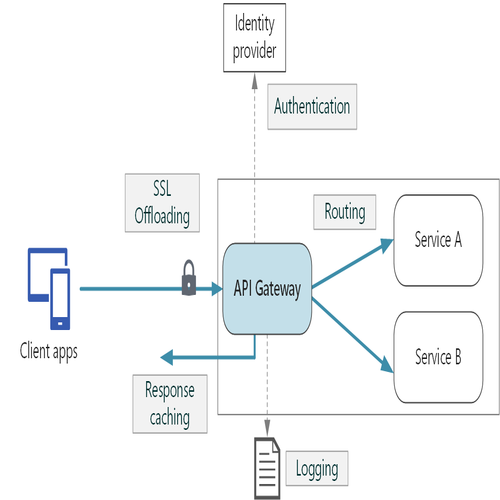

<div align=center>
<h1>Concept & Working Code For API Gateway</h1>

</div>

## Contents

- [How it works](#Concept)
- [Libraries used](#Libraries-Used)
- [Commands for running server](#Commands-for-running-server)
- [Production environment](#Production-Environment)

## concept

Here API Gateway is used for authenticating user request to Resource Server when Authentication server
validate the user for accessing Resource Server Resources. If Authentication Server,Deny user access for resource then
User will be UnAuthorized for that particular Resource. Through this we don't have to put resource access validation at different levels.
We don't have to cache the Resources on multiple sources as well.

## Libraries Used

- Axios for creating request to Authentication Server and Resource Servers as well.

## Commands for running server

### For running development server

```
npm run dev
```

### For running production server

```
npm run prod
```

## Production environment

It uses the <b>node.js</b> cluster module for running server with multiple threads.
